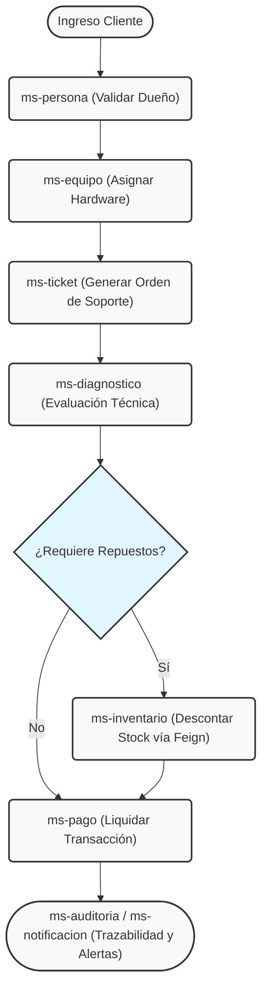

# 🛠️ FixNow - Sistema Distribuido de Soporte Técnico

           

> **FixNow** es un sistema backend robusto construido bajo el paradigma de **Arquitectura de Microservicios**. Su objetivo principal es orquestar, registrar y automatizar el flujo operativo completo de un servicio técnico: desde el ingreso del equipo por parte del cliente, pasando por el diagnóstico técnico y el control de stock de repuestos, hasta la facturación, notificación y auditoría inmutable de eventos.

---

## 📑 Tabla de Contenidos

* 👥 [Equipo de Desarrollo (Grupo 2)](#-equipo-de-desarrollo-grupo-2)
* 🏗️ [Topología de la Arquitectura Distribuida](#-topología-de-la-arquitectura-distribuida)
* ⚙️ [Stack Tecnológico y Patrones de Diseño Implementados](#-stack-tecnológico-y-patrones-de-diseño-implementados)
* 🛤️ [Diagrama de Flujo y Orquestación del Negocio](#-diagrama-de-flujo-y-orquestación-del-negocio)
* 🚀 [Guía de Despliegue Local (Entorno de Desarrollo)](#-guía-de-despliegue-local-entorno-de-desarrollo)
* 📜 [Documentación de API (Swagger / OpenAPI)](#-documentación-de-api-swagger--openapi)
* 🧪 [Pruebas Unitarias (JUnit) y Cobertura de Reglas de Negocio](#-pruebas-unitarias-junit-y-cobertura-de-reglas-de-negocio)
* 🚪 [API Gateway y Enrutamiento Dinámico (Spring Cloud Gateway)](#-api-gateway-y-enrutamiento-dinámico-spring-cloud-gateway)
* 🌍 [Guía de Despliegue Público (Port Forwarding VSCode)](#-guía-de-despliegue-público-port-forwarding-vscode)

---

## 👥 Equipo de Desarrollo (Grupo 2)
Este sistema ha sido diseñado, desarrollado y orquestado mediante control de versiones en GitHub por:
- **Jesús Amaya** - [@Jesusamayap](https://github.com/Jesusamayap)
- **Arianny Luna** - [@AriannyLunaA](https://github.com/AriannyLunaA)
- **Benjamín Aliste** - [@shirokamidev](https://github.com/shirokamidev)

---

## 🏗️ Topología de la Arquitectura Distribuida

Para asegurar los principios de **alta cohesión y bajo acoplamiento**, el monolito tradicional ha sido fragmentado en **11 microservicios** funcionales. Cada uno es responsable de un dominio de negocio altamente específico y posee su propia base de datos, garantizando la independencia tecnológica y resiliencia ante fallos.

| Servicio | Puerto Local | Base de Datos (MySQL) | Dominio / Responsabilidad Principal |
| :--- | :---: | :--- | :--- |
| `ms-registry` | **8761** | *N/A (Memoria)* | Servidor Eureka para descubrimiento y registro dinámico de servicios. |
| `ms-auth` | **8082** | `fixnow_auth` | Control de credenciales de usuario y emisión de accesos. |
| `ms-persona` | **8083** | `fixnow_persona` | Gestión integral de clientes y personal técnico (CRUD base). |
| `ms-equipo` | **8081** | `fixnow_equipo` | Inventario de hardware ingresado, asociado estrictamente a una persona. |
| `ms-inventario` | **8084** | `fixnow_inventario` | Catálogo de repuestos, precios y control estricto de stock físico. |
| `ms-ticket` | **8085** | `fixnow_ticket` | Emisión de órdenes de trabajo (entrelaza lógicamente a Persona y Equipo). |
| `ms-diagnostico`| **8088** | `fixnow_diagnostico` | Revisiones técnicas, estimación de viabilidad, tiempo, costo y repuestos. |
| `ms-pago` | **8087** | `fixnow_pago` | Motor transaccional para la liquidación de servicios realizados. |
| `ms-auditoria` | **8090** | `fixnow_auditoria` | Trazabilidad cruzada del sistema (Logs inmutables de todas las acciones). |
| `ms-notificacion`| **8091** | `fixnow_notificacion` | Generación y despacho de alertas informativas por correo al cliente. |
| `ms-gateway` | **8080** | *N/A (Enrutador)* | Puerta de enlace única (API Gateway) y balanceador de carga de peticiones. |

---

## ⚙️ Stack Tecnológico y Patrones de Diseño Implementados

El desarrollo del backend fue realizado utilizando **IntelliJ IDEA 2026.x**, haciendo uso intensivo del ecosistema de **Spring Cloud** y las mejores prácticas de ingeniería de software. A continuación, el detalle técnico de las herramientas aplicadas:

### 1. Entorno de Base de Datos (Laragon & MySQL)
Para el almacenamiento persistente, utilizamos el motor relacional **MySQL**. Para estandarizar el entorno de desarrollo local del equipo, utilizamos **Laragon**, un entorno universal portátil y de alto rendimiento que levanta el motor de MySQL en el puerto `3306`.

### 2. Persistencia y ORM (JPA & Hibernate)
En lugar de escribir sentencias SQL manuales y repetitivas, implementamos **Jakarta Persistence API (JPA)** junto con **Hibernate** como proveedor ORM.
Mediante la abstracción de `JpaRepository`, mapeamos directamente nuestras clases Java (`@Entity`) a las tablas relacionales. Esto agiliza las operaciones CRUD básicas y nos permite generar consultas automáticas como `findByIdTicket(Long id)`.

### 3. Versionamiento de Esquemas (Flyway)
Dado que estamos en una arquitectura distribuida donde cada microservicio es "dueño" de su base de datos, implementamos **Flyway** para mantener un control de versiones estricto de la estructura de datos:
- **Migraciones controladas:** Cada microservicio posee un directorio `db/migration` con scripts nativos (ej. `V1__crea_tabla_usuarios.sql`).
- **Seguridad Estructural:** Flyway crea las tablas (`DDL`) e inserta los registros de prueba (`DML`) en el arranque.
- **Validación de Integridad:** Se configuró JPA en modo `validate` (`spring.jpa.hibernate.ddl-auto=validate`) para asegurar que las entidades en código Java coincidan exactamente con la estructura creada en MySQL, evitando corrupciones estructurales.

### 4. Service Discovery (Netflix Eureka)
Para evitar el "hardcoding" de direcciones IP y facilitar el escalamiento, implementamos un servidor de registro centralizado (`ms-registry`).
Todos los microservicios están configurados como clientes (`@EnableDiscoveryClient`) y se anuncian en el servidor al arrancar. La resolución de rutas se realiza lógicamente por el nombre del servicio.

### 5. Comunicación Síncrona Declarativa (OpenFeign)
En un ecosistema fragmentado, los servicios necesitan "hablar" entre sí. En lugar de utilizar complejas llamadas manuales HTTP (como `RestTemplate`), implementamos **Spring Cloud OpenFeign**.

**¿Cómo funciona en el sistema?** Feign nos permite abstraer una petición HTTP transformándola en una simple interfaz Java. Por ejemplo, cuando el servicio `ms-ticket` necesita verificar que un equipo realmente existe antes de generar una orden, simplemente llama al método de la interfaz `EquipoClient` como si fuera un método local. Por debajo, Feign, apoyado en Eureka, busca la IP dinámica del servicio `ms-equipo` y ejecuta la validación, manteniendo nuestro código limpio y altamente legible.

### 6. Aislamiento y Transferencia (Patrón DTO)
Para no exponer el modelo de base de datos (`@Entity`) en la red, implementamos rigurosamente el patrón **Data Transfer Object (DTO)**. Los DTOs permiten:
- Empaquetar y transferir **solo la información estrictamente necesaria** entre servicios.
- Evitar problemas de recursividad (ciclos infinitos) al convertir relaciones bidireccionales de base de datos a formato JSON.
- Mantener los microservicios independientes estructuralmente.

### 7. Semántica REST y Respuestas HTTP (`ResponseEntity`)
La API respeta de forma estricta los estándares RESTful. Para controlar a bajo nivel la cabecera, el cuerpo y el código de estado HTTP de nuestras respuestas, envolvemos todos los retornos del Controlador con la clase `ResponseEntity`.
Manejamos semánticamente los códigos:
- `200 OK`: Consultas exitosas.
- `201 CREATED`: Persistencia exitosa de nuevas entidades (Ej. al emitir un Ticket).
- `204 NO CONTENT`: Consultas válidas pero que devuelven listas vacías.
- `400 BAD REQUEST`: Violaciones a reglas de negocio o DTOs mal formados.
- `404 NOT FOUND`: Recursos inexistentes en la base de datos según el ID buscado.

### 8. Integridad de Datos (Bean Validation JSR 380)
Para proteger nuestras bases de datos de información corrupta, implementamos validaciones desde la capa del Controlador mediante la especificación **Jakarta Bean Validation**.
Se inyectan anotaciones directamente en las propiedades de las clases (`@NotNull`, `@NotBlank`, `@Size`, `@Min`, `@Email`). El controlador intercepta las peticiones inyectando la etiqueta `@Valid` en el `@RequestBody`, rebotando la petición automáticamente con un error `400 Bad Request` antes de que afecte la capa de servicio.

### 9. Observabilidad y Trazabilidad (SLF4J + Lombok)
Para monitorizar el comportamiento del sistema distribuido y facilitar el debugging, incorporamos **Logs estructurados** a través de la interfaz **SLF4J**. Para reducir el código repetitivo, utilizamos la anotación `@Slf4j` de **Lombok**.
A lo largo de los Controladores y Servicios, se registran eventos clave:
- `log.info(...)`: Para marcar el inicio de un proceso o recepciones HTTP exitosas.
- `log.warn(...)`: Para identificar validaciones de negocio fallidas.
- `log.error(...)`: Para capturar excepciones críticas o caídas de conexión externa.

### 10. Enrutamiento Centralizado (Spring Cloud Gateway)
Para proteger la red interna y evitar que los clientes consuman IPs directas, implementamos el patrón **API Gateway**. Funciona como un proxy inverso y único punto de entrada (puerto `8080`), interceptando todas las peticiones y enrutándolas dinámicamente hacia el microservicio correspondiente consultando los registros en Eureka.

---

## 🛤️ Diagrama de Flujo y Orquestación del Negocio

El siguiente diagrama representa el ciclo de vida de una atención estándar, reflejando cómo interactúan en secuencia los microservicios sin acoplarse directamente a las bases de datos ajenas:

---

## 🚀 Guía de Despliegue Local (Entorno de Desarrollo)

Para levantar el ecosistema completo desde IntelliJ IDEA:

1. **Requisitos del Sistema:** Instalar Java JDK 21, Apache Maven, IDE IntelliJ 2026.x y **Laragon**.
2. **Inicializar Motor SQL:** Iniciar los servicios de Laragon (asegurando que MySQL levante en el puerto `3306`).
3. **Creación de Esquemas:** Acceder al gestor de MySQL (ej. HeidiSQL incluido en Laragon) y ejecutar los scripts para crear las 9 bases de datos vacías:
   - `CREATE DATABASE fixnow_auth;`
   - `CREATE DATABASE fixnow_persona;`, etc.
4. **Boot Secuencial Fase 1 (Discovery):** Ejecutar como aplicación Spring Boot el módulo `ms-registry`. Aguardar a que inicie el servidor Tomcat en el puerto `8761`.
5. **Boot Secuencial Fase 2 (Core & Migrations):** Iniciar `ms-persona`, `ms-equipo`, e `ms-inventario`. Al levantar, se observarán los Logs de **Flyway** validando las tablas e insertando los datos iniciales.
6. **Boot Secuencial Fase 3 (Orchestration):** Levantar el resto de los módulos de negocio (`ms-ticket`, `ms-diagnostico`, `ms-pago`, `ms-auditoria`, `ms-notificacion`).
7. **Boot Secuencial Fase 4 (Gateway):** **Es estrictamente necesario levantar `ms-gateway` al final.** Esto garantiza que Eureka ya tenga el registro de todos los servicios activos para poder enrutar correctamente.
8. **Monitoreo:** Abrir el navegador en `http://localhost:8761/` y verificar en el Dashboard de Eureka que las instancias figuren en estado `UP`.
9. **Pruebas en Postman:** Todas las peticiones deben hacerse apuntando **únicamente** al puerto del Gateway (`8080`). Ejemplo: `GET http://localhost:8080/api/v1/pagos`.

---

## 📜 Documentación de API (Swagger / OpenAPI)

Para garantizar la accesibilidad, comprensión y pruebas de los servicios expuestos, se ha implementado la especificación **OpenAPI (OAS)** utilizando **Swagger UI** (`springdoc-openapi`).

### 🎯 ¿Para qué sirve y por qué es fundamental?
Una API sin documentación clara se convierte en código muerto o inaccesible. La implementación de Swagger en este ecosistema distribuido cumple objetivos estratégicos:
1. **Prevención de "Código Muerto":** Asegura que todos los endpoints sean descubribles, entendibles y testeables desde el primer día.
2. **Listo para Producción y Terceros:** Demuestra que los microservicios están preparados para ser consumidos por sistemas externos, exponiendo contratos de comunicación claros y estandarizados.
3. **Integración Ágil Frontend - Backend:** Facilita la integración inmediata. El equipo de Frontend o los integradores pueden saber exactamente qué datos enviar y qué formato de respuesta esperar a través de una interfaz visual interactiva, sin necesidad de hacer preguntas constantes ni tener que descifrar el código fuente en Java.

### 📌 Anotaciones de Documentación Implementadas
Para estructurar la documentación de forma semántica y profesional en la capa de Controladores, se utilizaron las siguientes anotaciones:

* **`@Tag`**: Agrupa todos los endpoints del controlador bajo un nombre y descripción principal en la interfaz de Swagger.
* **`@Operation`**: Describe qué hace un endpoint específico. Se visualiza como el título y la descripción detallada de la operación.
* **`@Parameter`**: Documenta un parámetro de tipo `@PathVariable` o `@RequestParam`, indicando al consumidor de la API qué dato exacto se requiere ingresar.
* **`@ApiResponse`**: Define un código de respuesta HTTP específico (ej. `200 OK`, `201 CREATED`, `404 NOT FOUND`) y su descripción. Se encadenan múltiples anotaciones en un mismo método para documentar todos los posibles resultados.

### 🌐 Acceso y Glosario de Endpoints por Microservicio
Cada módulo de negocio cuenta con su propia interfaz gráfica e interactiva. A continuación, el detalle de puertos, URLs de acceso y endpoints documentados:

#### 🔐 1. API Auth (ms-auth)
* **Puerto Local:** `8082`
* **URL de Acceso:** [http://localhost:8082/swagger-ui/index.html](http://localhost:8082/swagger-ui/index.html)
* **Endpoints Disponibles:**
   * `POST /api/v1/auth/login`: Valida las credenciales de un usuario y devuelve login exitoso.
   * `GET /api/v1/auth`: Obtiene todos los usuarios con credenciales registradas.
   * `GET /api/v1/auth/roles?rol={nombreRol}`: Obtiene una lista de usuarios filtrados por su rol asignado (Ej: TECNICO, ADMIN).

#### 👤 2. API Persona (ms-persona)
* **Puerto Local:** `8083`
* **URL de Acceso:** [http://localhost:8083/swagger-ui/index.html](http://localhost:8083/swagger-ui/index.html)
* **Endpoints Disponibles:**
   * `GET /api/v1/personas`: Obtiene todas las personas registradas.
   * `POST /api/v1/personas/`: Registra una nueva persona en el sistema.
   * `GET /api/v1/personas/{id}`: Busca los detalles de una persona por ID.
   * `PUT /api/v1/personas/{id}`: Actualiza los datos de una persona existente.
   * `DELETE /api/v1/personas/{id}`: Elimina una persona por ID.

#### 💻 3. API Equipo (ms-equipo)
* **Puerto Local:** `8081`
* **URL de Acceso:** [http://localhost:8081/swagger-ui/index.html](http://localhost:8081/swagger-ui/index.html)
* **Endpoints Disponibles:**
   * `GET /api/v1/equipo`: Devuelve el inventario completo de los equipos registrados.
   * `POST /api/v1/equipo`: Registra un nuevo equipo en la base de datos.
   * `GET /api/v1/equipo/{id}`: Obtiene los detalles de un equipo en específico.
   * `GET /api/v1/equipo/persona/{idPersona}`: Obtiene todos los equipos asociados al ID de una persona.

#### 🎫 4. API Ticket (ms-ticket)
* **Puerto Local:** `8085`
* **URL de Acceso:** [http://localhost:8085/swagger-ui/index.html](http://localhost:8085/swagger-ui/index.html)
* **Endpoints Disponibles:**
   * `GET /api/v1/ticket`: Retorna la lista completa de tickets registrados en el sistema.
   * `POST /api/v1/ticket/`: Registra un ticket en el sistema validando la integridad del DTO.
   * `GET /api/v1/ticket/{id}`: Retorna los detalles de un ticket específico según su ID.

#### 🛠️ 5. API Diagnóstico (ms-diagnostico)
* **Puerto Local:** `8088`
* **URL de Acceso:** [http://localhost:8088/swagger-ui/index.html](http://localhost:8088/swagger-ui/index.html)
* **Endpoints Disponibles:**
   * `GET /api/v1/diagnostico`: Retorna la lista completa de diagnósticos emitidos en el sistema.
   * `POST /api/v1/diagnostico/`: Registra un diagnóstico técnico validando los datos de entrada.
   * `GET /api/v1/diagnostico/{id}`: Retorna los detalles de un diagnóstico específico.

#### 📦 6. API Inventario (ms-inventario)
* **Puerto Local:** `8084`
* **URL de Acceso:** [http://localhost:8084/swagger-ui/index.html](http://localhost:8084/swagger-ui/index.html)
* **Endpoints Disponibles:**
   * `GET /api/v1/inventario`: Permite consultar todos los repuestos.
   * `POST /api/v1/inventario/`: Crea un nuevo repuesto en el sistema validando los datos requeridos.
   * `GET /api/v1/inventario/{id}`: Retorna un repuesto específico del inventario.
   * `PUT /api/v1/inventario/{id}/descontar`: Disminuye el stock disponible de un repuesto según la cantidad indicada.

#### 💳 7. API Pagos (ms-pago)
* **Puerto Local:** `8087`
* **URL de Acceso:** [http://localhost:8087/swagger-ui/index.html](http://localhost:8087/swagger-ui/index.html)
* **Endpoints Disponibles:**
   * `GET /api/v1/pagos`: Obtener la lista completa de pagos registrados.
   * `POST /api/v1/pagos/`: Registrar una nueva transacción de pago en el sistema.
   * `GET /api/v1/pagos/{id}`: Buscar un registro de pago específico por su ID.
   * `GET /api/v1/pagos/ticket/{idTicket}`: Obtener el historial de pagos asociados a un ticket.

#### 🔔 8. API Notificaciones (ms-notificacion)
* **Puerto Local:** `8091`
* **URL de Acceso:** [http://localhost:8091/swagger-ui/index.html](http://localhost:8091/swagger-ui/index.html)
* **Endpoints Disponibles:**
   * `GET /api/v1/notificaciones`: Obtener el historial completo de notificaciones enviadas.
   * `POST /api/v1/notificaciones/`: Generar y enviar una nueva notificación.
   * `GET /api/v1/notificaciones/{id}`: Buscar una notificación específica por su ID.
   * `GET /api/v1/notificaciones/ticket/{idTicket}`: Obtener el historial de notificaciones de un ticket.

#### 📋 9. API Auditoría (ms-auditoria)
* **Puerto Local:** `8090`
* **URL de Acceso:** [http://localhost:8090/swagger-ui/index.html](http://localhost:8090/swagger-ui/index.html)
* **Endpoints Disponibles:**
   * `GET /api/v1/auditoria`: Obtener el registro completo de eventos del sistema.
   * `POST /api/v1/auditoria/`: Registrar un nuevo evento de auditoría.
   * `GET /api/v1/auditoria/{id}`: Buscar un evento específico por su ID.
   * `GET /api/v1/auditoria/ticket/{idTicket}`: Obtener el historial de eventos asociados a un ticket.

---

## 🧪 Pruebas Unitarias (JUnit) y Cobertura de Reglas de Negocio

Para garantizar la calidad del software, la estabilidad de la capa de servicios y la correcta validación de las reglas de negocio, se implementaron pruebas unitarias automatizadas utilizando el framework **JUnit 5** y la anotación `@SpringBootTest`.

### 🎯 ¿Para qué sirven y por qué son importantes?
Las pruebas unitarias verifican el comportamiento de la porción más pequeña de código (una unidad o método) de forma totalmente aislada. Su implementación en este ecosistema nos otorga beneficios críticos:
1. **El Juez de la Lógica:** Actúan como el filtro definitivo de calidad. **Si una prueba unitaria es válida y estricta, pero el código está mal escrito o la lógica falla, la prueba fallará inexorablemente**. Esto asegura que el código no solo compile, sino que realmente cumpla con lo que el negocio exige.
2. **Detección temprana de errores:** Permiten identificar bugs en el momento del desarrollo antes de llegar a producción.
3. **Refactorización segura:** Garantizan que, al modificar o mejorar un microservicio en el futuro, no rompamos funcionalidades existentes.
4. **Documentación activa:** Cada test funciona como un manual en código que describe exactamente qué se espera de cada módulo.

### ⚙️ Entorno de Ejecución y Aserciones
Todas las pruebas se ejecutan bajo un entorno estructurado y aislado para no afectar los datos de producción:
* **Perfil de Ejecución:** `test` (`spring.profiles.active=test`).
* **Aserciones Utilizadas (Asserts):**
   * `assertNotNull`: Verifica que los campos obligatorios y críticos para el modelo no sean nulos, previniendo excepciones de sistema.
   * `assertTrue` / `assertFalse`: Evalúa condiciones lógicas o matemáticas estrictas (ej. montos mayores a 0, validación de formatos, límites de caracteres).
   * `assertNull`: Garantiza la consistencia estructural exigiendo que ciertos campos permanezcan vacíos cuando el contexto lo dictamina.

A continuación, se detalla la cobertura técnica y las reglas de negocio validadas por cada microservicio:

### 🔐 1. API Auth (ms-auth)
* **Base de datos de pruebas:** `fixnow_auth_test`
* **Total de pruebas automatizadas:** 4
* **Reglas Validadas:**
   * **Obligatoriedad de Credenciales:** Valida mediante `assertNotNull` que el `username` y el `rol` (ej. TECNICO, ADMIN) no estén vacíos.
   * **Seguridad de Contraseñas:** Asegura mediante `assertTrue` que las contraseñas cumplan con un mínimo de 25 caracteres.
   * **Límites de Usuario:** Verifica mediante `assertTrue` que el nombre de usuario no exceda los 255 caracteres permitidos.
   * **Integridad de Carga:** Comprueba mediante `assertFalse` que la consulta al repositorio devuelva el catálogo de usuarios correctamente.

### 👤 2. API Persona (ms-persona)
* **Base de datos de pruebas:** `fixnow_persona_test`
* **Total de pruebas automatizadas:** 3
* **Reglas Validadas:**
   * **Identidad Obligatoria:** Utiliza `assertNotNull` para garantizar que los campos `nombres` y `apellidos` siempre existan.
   * **Formato de RUT:** Evalúa mediante `assertTrue` que la longitud de la cadena del RUT ingresado no supere el límite de 12 caracteres.
   * **Validación de Correo:** Valida mediante `assertNotNull` y `assertTrue` que el correo electrónico contenga obligatoriamente el carácter `@`.

### 💻 3. API Equipo (ms-equipo)
* **Base de datos de pruebas:** `fixnow_equipo_test`
* **Total de pruebas automatizadas:** 3
* **Reglas Validadas:**
   * **Asignación de Dueño:** Garantiza mediante `assertNotNull` que todo equipo registrado posea un `idPersona` asociado.
   * **Límites Descriptivos:** Valida con `assertTrue` que la `marca` (max 50) y el `modelo` (max 100) no excedan la capacidad de la base de datos.
   * **Componentes Base:** Asegura mediante `assertNotNull` que el procesador, memoria RAM y almacenamiento sean informados obligatoriamente.

### 🎫 4. API Ticket (ms-ticket)
* **Base de datos de pruebas:** `fixnow_ticket_test`
* **Total de pruebas automatizadas:** 3
* **Reglas Validadas:**
   * **Descripción Detallada:** Usa `assertNotNull` y `assertFalse` para evitar descripciones de fallas en blanco.
   * **Trazabilidad Cruzada:** Verifica con `assertTrue` que el ticket apunte a un `idPersona` y a un `idEquipo` válidos (mayores a 0).
   * **Consistencia de Estados:** Asegura con `assertTrue` que el estado del ticket respete el flujo del negocio (INGRESADO, EN_REVISION, EN_REPARACION, FINALIZADO).

### 🛠️ 5. API Diagnóstico (ms-diagnostico)
* **Base de datos de pruebas:** `fixnow_diagnostico_test`
* **Total de pruebas automatizadas:** 3
* **Reglas Validadas:**
   * **Lógica de Repuestos:** Aplica `assertNull` para verificar que si el diagnóstico dicta que *NO* requiere repuesto, su ID y cantidad estén vacíos.
   * **Viabilidad de Estimación:** Evalúa con `assertTrue` que el `costoEstimado` sea mayor a 0 y que el tiempo tome al menos 1 día hábil.
   * **Origen del Diagnóstico:** Garantiza mediante `assertNotNull` que todo informe provenga de un `idTicket` válido.

### 📦 6. API Inventario (ms-inventario)
* **Base de datos de pruebas:** `fixnow_inventario_test`
* **Total de pruebas automatizadas:** 4
* **Reglas Validadas:**
   * **Identificación del Repuesto:** Valida con `assertNotNull` que el nombre del producto no llegue vacío.
   * **Stock Real:** Utiliza `assertTrue` para garantizar que la cantidad en stock sea `>= 0`, impidiendo inventarios negativos.
   * **Lógica de Precios:** Verifica con `assertTrue` que el `precioUnitario` sea mayor o igual a cero.
   * **Disponibilidad de Catálogo:** Asegura mediante `assertFalse` que el repositorio contenga los repuestos registrados.

### 💳 7. API Pagos (ms-pago)
* **Base de datos de pruebas:** `fixnow_pago_test`
* **Total de pruebas automatizadas:** 4
* **Reglas Validadas:**
   * **Monto Mínimo Requerido:** Verifica con `assertTrue` que el monto total de cualquier transacción sea estrictamente mayor a cero.
   * **Obligatoriedad de Método:** Valida con `assertNotNull` y `assertFalse` que el método de pago no sea texto en blanco.
   * **Estados Transaccionales:** Comprueba con `assertTrue` que los estados de los pagos respeten la nomenclatura (PAGADO o PENDIENTE).
   * **Asociación de Ticket:** Garantiza con `assertTrue` que todo pago cuente con una referencia válida hacia un Ticket (`idTicket` > 0).

### 🔔 8. API Notificaciones (ms-notificacion)
* **Base de datos de pruebas:** `fixnow_notificacion_test`
* **Total de pruebas automatizadas:** 3
* **Reglas Validadas:**
   * **Formato de Correo Destino:** Valida con `assertNotNull` y `assertTrue` que el correo contenga un `@` para asegurar su enrutamiento.
   * **Integridad del Mensaje:** Comprueba con `assertFalse` que el cuerpo del mensaje no esté en blanco, evitando notificaciones vacías.
   * **Consistencia del Evento:** Verifica con `assertTrue` que el tipo de notificación corresponda a un evento válido (ej. INGRESO, PAGO_RECIBIDO).

### 📋 9. API Auditoría (ms-auditoria)
* **Base de datos de pruebas:** `fixnow_auditoria_test`
* **Total de pruebas automatizadas:** 3
* **Reglas Validadas:**
   * **Trazabilidad Relacional:** Valida con `assertTrue` que el registro referencie al menos a una entidad base (Ticket, Pago o Persona).
   * **Calidad de Contexto:** Comprueba con `assertTrue` que los detalles del evento posean una longitud mínima descriptiva de 15 caracteres.
   * **Consistencia de Eventos:** Verifica con `assertNotNull` la lógica cruzada; si la acción es "PAGO_PROCESADO", el sistema exige el ID del pago.

---

## 🚪 API Gateway y Enrutamiento Dinámico (Spring Cloud Gateway)

Para centralizar el acceso, simplificar el consumo por parte de los clientes y proteger la topología interna del ecosistema, se implementó **Spring Cloud Gateway** (`ms-gateway`). Este componente actúa como el director de orquesta de las peticiones, operando bajo el puerto unificado `8080`.

### 🎯 Funciones y Configuración Técnica
La configuración del Gateway (`application.yml`) fue diseñada para trabajar en integración nativa con el Service Discovery (Netflix Eureka), logrando una arquitectura resiliente y altamente escalable:

* **Punto de Acceso Único (Single Entry Point):** Los clientes externos (aplicaciones Frontend, Postman, usuarios) no necesitan conocer las direcciones IP ni los puertos específicos internos (8081, 8082, etc.) de los 9 microservicios. Absolutamente todas las peticiones ingresan por el puerto `8080` y el Gateway se encarga de distribuirlas.
* **Enrutamiento Dinámico con Eureka:** En lugar de utilizar rutas estáticas o IPs hardcodeadas, el enrutador se configuró utilizando el esquema `uri: lb://[nombre-servicio]`. Esto permite que el Gateway consulte a Eureka en tiempo real para obtener las direcciones activas. Si la ubicación de un servicio cambia o se reinicia, la conexión se mantiene intacta de forma dinámica.
* **Balanceo de Carga del Lado del Cliente (Client-Side Load Balancing):** El prefijo `lb://` activa automáticamente el balanceador de carga integrado. Si en un futuro un microservicio escala horizontalmente (ej. múltiples instancias de `ms-pago`), el Gateway distribuirá el tráfico entrante de manera equitativa entre todas las instancias disponibles de forma transparente.
* **Observabilidad de Rutas (Debug Mode):** Para facilitar el monitoreo del tráfico, se habilitó el nivel de registro `DEBUG` específicamente para el paquete `org.springframework.cloud.gateway`, permitiendo trazar por consola cómo entra y hacia dónde sale cada petición HTTP.

### 🔀 Interceptación por Predicados (Predicates)
El tráfico se captura y redirige estrictamente evaluando la ruta de la petición HTTP recibida. Mediante el uso de la directiva `Path`, se asignaron las reglas de enrutamiento para los 9 microservicios del sistema:

* `Path=/api/v1/auth/**` ➔ Redirige al clúster de Autenticación (`lb://ms-auth`).
* `Path=/api/v1/personas/**` ➔ Redirige al clúster de Personas (`lb://ms-persona`).
* `Path=/api/v1/equipo/**` ➔ Redirige al clúster de Equipos (`lb://ms-equipo`).
* `Path=/api/v1/ticket/**` ➔ Redirige al clúster de Tickets de Soporte (`lb://ms-ticket`).
* `Path=/api/v1/diagnostico/**` ➔ Redirige al clúster de Diagnósticos Técnicos (`lb://ms-diagnostico`).
* `Path=/api/v1/inventario/**` ➔ Redirige al clúster de Inventario y Repuestos (`lb://ms-inventario`).
* `Path=/api/v1/pagos/**` ➔ Redirige al clúster de Transacciones y Pagos (`lb://ms-pago`).
* `Path=/api/v1/notificaciones/**` ➔ Redirige al clúster de Alertas al Cliente (`lb://ms-notificacion`).
* `Path=/api/v1/auditoria/**` ➔ Redirige al clúster de Trazabilidad y Logs (`lb://ms-auditoria`).

---

## 🌍 Guía de Despliegue Público (Port Forwarding VSCode)

Para facilitar las pruebas de integración, permitir el consumo de la API desde dispositivos externos o presentar el proyecto sin necesidad de contratar un servidor Cloud (PaaS), se implementó el despliegue mediante el **Port Forwarding nativo de Visual Studio Code**.

### 🎯 ¿Para qué sirve y cuál es su función?
Esta herramienta crea un túnel seguro que expone nuestro entorno local (`localhost`) hacia la internet pública. Esto significa que cualquier persona, dispositivo o cliente REST externo (como Postman) que posea la URL generada, podrá consumir los endpoints de FixNow desde cualquier parte del mundo. Al exponer únicamente el API Gateway, mantenemos toda la red interna de microservicios protegida de forma local.

### ⚠️ Secuencia Crítica de Arranque (Orquestación)
Antes de exponer el proyecto, es obligatorio levantar el ecosistema en un orden lógico estricto. Si no se respeta, el enrutador fallará al no encontrar los servicios:
1. **Fase 1:** Iniciar el Servidor Eureka (`ms-registry`).
2. **Fase 2:** Iniciar todos los microservicios Core (`ms-auth`, `ms-persona`, `ms-equipo`, `ms-ticket`, etc.) y esperar a que se registren en Eureka.
3. **Fase 3:** **Iniciar el API Gateway (`ms-gateway`) al final.** Al ser el director de orquesta, necesita que Eureka ya posea el mapa completo de las IPs y puertos activos para poder generar las rutas dinámicas correctamente.

### 🛠️ Pasos de Implementación en VSCode
Una vez que toda la arquitectura esté corriendo y el Gateway esté escuchando en el puerto `8080`, sigue estos pasos:

1. **Autenticación:** Abre Visual Studio Code. Es un requisito obligatorio tener una **cuenta de GitHub vinculada** e iniciada en el editor para que Microsoft habilite la creación de túneles.
2. **Panel de Puertos:** Abre la consola inferior de VSCode y dirígete a la pestaña llamada **"Ports" (Puertos)**. Si no la ves, abre una nueva terminal y busca la pestaña al lado de "Terminal" y "Output".
3. **Redireccionar:** Haz clic en *Forward a Port* (Redireccionar un puerto) e ingresa el puerto por donde escucha nuestro Gateway: **`8080`**.
4. **Cambio de Visibilidad:** VSCode generará automáticamente una "Dirección reenviada" (URL). Por defecto, su visibilidad es *Privada* (solo accesible en tu red local). Haz clic derecho sobre el puerto reenviado, selecciona **"Port Visibility"** (Visibilidad de puertos) y cámbialo a **"Public"** (Público).
5. **Prueba Exitosa:** ¡Listo! Copia la URL generada. Ahora puedes realizar peticiones a toda la arquitectura usando esa URL base en Postman (ej. `https://tu-url-generada.trycloudflare.com/api/v1/auth/login`) en lugar de `localhost`, logrando un despliegue 100% funcional.